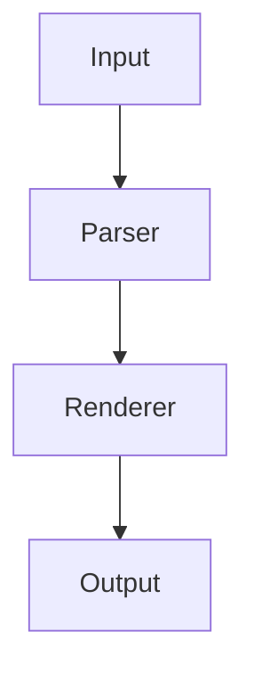

# Shine Implementation Plan

> **For agentic workers:** REQUIRED SUB-SKILL: Use superpowers:subagent-driven-development (recommended) or superpowers:executing-plans to implement this plan task-by-task. Steps use checkbox (`- [ ]`) syntax for tracking.

**Goal:** Build `shine`, a terminal Markdown viewer in Go that renders Markdown with rich, web-like visual containers for code blocks, diagrams, tree output, and tables.

**Architecture:** Parse Markdown with `goldmark` into an AST, walk it with a custom renderer that emits ANSI-styled terminal output using `lipgloss` for containers/borders and `chroma` for syntax highlighting. CLI built with `cobra`, auto-pages with `$PAGER` when output exceeds terminal height.

**Tech Stack:** Go, goldmark, chroma, lipgloss, cobra, golang.org/x/term

---

## File Structure

```
shine/
├── cmd/
│   └── shine/
│       └── main.go                  # CLI entry point, cobra root command
├── internal/
│   ├── renderer/
│   │   ├── renderer.go              # goldmark Renderer implementation, AST dispatch
│   │   ├── renderer_test.go         # Unit tests for renderer
│   │   ├── headings.go              # Heading (H1-H6) rendering
│   │   ├── headings_test.go         # Tests for headings
│   │   ├── inline.go                # Bold, italic, strikethrough, links, images, inline code
│   │   ├── inline_test.go           # Tests for inline elements
│   │   ├── codeblock.go             # Fenced code block rendering + container detection
│   │   ├── codeblock_test.go        # Tests for code blocks and visual containers
│   │   ├── blockquote.go            # Blockquote rendering
│   │   ├── blockquote_test.go       # Tests for blockquotes
│   │   ├── list.go                  # Ordered + unordered list rendering
│   │   ├── list_test.go             # Tests for lists
│   │   ├── table.go                 # Table rendering with box-drawing
│   │   └── table_test.go            # Tests for tables
│   ├── theme/
│   │   ├── theme.go                 # Theme struct, DarkTheme, LightTheme
│   │   ├── theme_test.go            # Tests for theme
│   │   └── detect.go                # Terminal background auto-detection
│   └── pager/
│       ├── pager.go                 # Pager logic (exec $PAGER or less -R)
│       └── pager_test.go            # Tests for pager
├── testdata/
│   ├── headings.md                  # Test fixture: headings
│   ├── codeblocks.md                # Test fixture: code blocks with various languages
│   ├── containers.md                # Test fixture: tree, diagram, shell containers
│   ├── inline.md                    # Test fixture: bold, italic, links, images
│   ├── lists.md                     # Test fixture: ordered, unordered, nested
│   ├── tables.md                    # Test fixture: simple and complex tables
│   └── full.md                      # Test fixture: full document with all elements
├── go.mod
├── go.sum
└── README.md
```

---

### Task 1: Project Scaffold + Go Module

**Files:**
- Create: `go.mod`
- Create: `cmd/shine/main.go`

- [ ] **Step 1: Initialize Go module**

Run:
```bash
go mod init github.com/vinaychitepu/shine
```

- [ ] **Step 2: Create minimal main.go**

Create `cmd/shine/main.go`:

```go
package main

import "fmt"

func main() {
	fmt.Println("shine")
}
```

- [ ] **Step 3: Verify it compiles and runs**

Run:
```bash
go run ./cmd/shine
```
Expected output: `shine`

- [ ] **Step 4: Install dependencies**

Run:
```bash
go get github.com/yuin/goldmark
go get github.com/alecthomas/chroma/v2
go get github.com/charmbracelet/lipgloss
go get github.com/spf13/cobra
go get golang.org/x/term
```

- [ ] **Step 5: Verify module is clean**

Run:
```bash
go mod tidy
go build ./cmd/shine
```
Expected: builds with no errors.

- [ ] **Step 6: Commit**

```bash
git add .
git commit -m "feat: scaffold project with go module and dependencies"
```

---

### Task 2: Theme System

**Files:**
- Create: `internal/theme/theme.go`
- Create: `internal/theme/detect.go`
- Create: `internal/theme/theme_test.go`

- [ ] **Step 1: Write the failing test for theme struct and defaults**

Create `internal/theme/theme_test.go`:

```go
package theme

import "testing"

func TestDarkThemeNotNil(t *testing.T) {
	th := DarkTheme()
	if th.H1.Value() == "" {
		t.Fatal("DarkTheme H1 style should not be empty")
	}
}

func TestLightThemeNotNil(t *testing.T) {
	th := LightTheme()
	if th.H1.Value() == "" {
		t.Fatal("LightTheme H1 style should not be empty")
	}
}

func TestDetectThemeFallbackDark(t *testing.T) {
	// With no env vars set, should fall back to dark
	th := Detect("")
	// We can't easily compare structs, but we can check it doesn't panic
	if th.H1.Value() == "" {
		t.Fatal("Detect fallback should return a valid theme")
	}
}

func TestDetectThemeExplicitOverride(t *testing.T) {
	t.Setenv("SHINE_THEME", "light")
	th := Detect("")
	// Light theme uses different colors — just verify it returns without panic
	if th.H1.Value() == "" {
		t.Fatal("Detect with SHINE_THEME=light should return a valid theme")
	}
}

func TestDetectThemeFlagOverride(t *testing.T) {
	th := Detect("light")
	if th.H1.Value() == "" {
		t.Fatal("Detect with flag=light should return a valid theme")
	}
}
```

- [ ] **Step 2: Run test to verify it fails**

Run:
```bash
go test ./internal/theme/ -v
```
Expected: compilation error — package/types don't exist yet.

- [ ] **Step 3: Implement theme.go**

Create `internal/theme/theme.go`:

```go
package theme

import "github.com/charmbracelet/lipgloss"

// Theme holds all styles used by the renderer.
type Theme struct {
	// Text
	Normal        lipgloss.Style
	Bold          lipgloss.Style
	Italic        lipgloss.Style
	Strikethrough lipgloss.Style
	Dim           lipgloss.Style

	// Headings
	H1          lipgloss.Style
	H2          lipgloss.Style
	H3          lipgloss.Style
	HeadingRule lipgloss.Style

	// Code
	CodeBorder   lipgloss.Color
	CodeHeader   lipgloss.Style
	InlineCode   lipgloss.Style
	ChromaStyle  string // chroma style name

	// Container variants
	TreeBorder    lipgloss.Color
	DiagramBorder lipgloss.Color
	ShellBorder   lipgloss.Color

	// Blockquote
	BlockquoteBar  lipgloss.Style
	BlockquoteText lipgloss.Style

	// Table
	TableHeader lipgloss.Style
	TableBorder lipgloss.Color

	// Links / Images
	LinkText lipgloss.Style
	LinkURL  lipgloss.Style
	ImageAlt lipgloss.Style

	// Horizontal rule
	HorizontalRule lipgloss.Style
}

// DarkTheme returns the built-in dark theme.
func DarkTheme() Theme {
	return Theme{
		Normal:        lipgloss.NewStyle(),
		Bold:          lipgloss.NewStyle().Bold(true),
		Italic:        lipgloss.NewStyle().Italic(true),
		Strikethrough: lipgloss.NewStyle().Strikethrough(true),
		Dim:           lipgloss.NewStyle().Faint(true),

		H1:          lipgloss.NewStyle().Bold(true).Foreground(lipgloss.Color("#61AFEF")),
		H2:          lipgloss.NewStyle().Bold(true).Foreground(lipgloss.Color("#C678DD")),
		H3:          lipgloss.NewStyle().Foreground(lipgloss.Color("#E5C07B")),
		HeadingRule: lipgloss.NewStyle().Foreground(lipgloss.Color("#3E4451")),

		CodeBorder:  lipgloss.Color("#3E4451"),
		CodeHeader:  lipgloss.NewStyle().Foreground(lipgloss.Color("#ABB2BF")).Faint(true),
		InlineCode:  lipgloss.NewStyle().Background(lipgloss.Color("#2C313C")),
		ChromaStyle: "dracula",

		TreeBorder:    lipgloss.Color("#98C379"),
		DiagramBorder: lipgloss.Color("#61AFEF"),
		ShellBorder:   lipgloss.Color("#E5C07B"),

		BlockquoteBar:  lipgloss.NewStyle().Foreground(lipgloss.Color("#3E4451")),
		BlockquoteText: lipgloss.NewStyle().Foreground(lipgloss.Color("#5C6370")),

		TableHeader: lipgloss.NewStyle().Bold(true).Foreground(lipgloss.Color("#61AFEF")),
		TableBorder: lipgloss.Color("#3E4451"),

		LinkText: lipgloss.NewStyle().Foreground(lipgloss.Color("#61AFEF")),
		LinkURL:  lipgloss.NewStyle().Faint(true),
		ImageAlt: lipgloss.NewStyle().Italic(true).Faint(true),

		HorizontalRule: lipgloss.NewStyle().Foreground(lipgloss.Color("#3E4451")),
	}
}

// LightTheme returns the built-in light theme.
func LightTheme() Theme {
	return Theme{
		Normal:        lipgloss.NewStyle(),
		Bold:          lipgloss.NewStyle().Bold(true),
		Italic:        lipgloss.NewStyle().Italic(true),
		Strikethrough: lipgloss.NewStyle().Strikethrough(true),
		Dim:           lipgloss.NewStyle().Faint(true),

		H1:          lipgloss.NewStyle().Bold(true).Foreground(lipgloss.Color("#0366D6")),
		H2:          lipgloss.NewStyle().Bold(true).Foreground(lipgloss.Color("#6F42C1")),
		H3:          lipgloss.NewStyle().Foreground(lipgloss.Color("#B08800")),
		HeadingRule: lipgloss.NewStyle().Foreground(lipgloss.Color("#D0D7DE")),

		CodeBorder:  lipgloss.Color("#D0D7DE"),
		CodeHeader:  lipgloss.NewStyle().Foreground(lipgloss.Color("#57606A")).Faint(true),
		InlineCode:  lipgloss.NewStyle().Background(lipgloss.Color("#F6F8FA")),
		ChromaStyle: "github",

		TreeBorder:    lipgloss.Color("#1A7F37"),
		DiagramBorder: lipgloss.Color("#0366D6"),
		ShellBorder:   lipgloss.Color("#B08800"),

		BlockquoteBar:  lipgloss.NewStyle().Foreground(lipgloss.Color("#D0D7DE")),
		BlockquoteText: lipgloss.NewStyle().Foreground(lipgloss.Color("#57606A")),

		TableHeader: lipgloss.NewStyle().Bold(true).Foreground(lipgloss.Color("#0366D6")),
		TableBorder: lipgloss.Color("#D0D7DE"),

		LinkText: lipgloss.NewStyle().Foreground(lipgloss.Color("#0366D6")),
		LinkURL:  lipgloss.NewStyle().Faint(true),
		ImageAlt: lipgloss.NewStyle().Italic(true).Faint(true),

		HorizontalRule: lipgloss.NewStyle().Foreground(lipgloss.Color("#D0D7DE")),
	}
}
```

- [ ] **Step 4: Implement detect.go**

Create `internal/theme/detect.go`:

```go
package theme

import (
	"os"
	"strconv"
	"strings"
)

// Detect returns a Theme based on the flag override, env vars, or heuristics.
// flagValue is the --theme flag value ("dark", "light", or "" for auto).
func Detect(flagValue string) Theme {
	mode := detectMode(flagValue)
	if mode == "light" {
		return LightTheme()
	}
	return DarkTheme()
}

func detectMode(flagValue string) string {
	// 1. Flag override
	if flagValue == "dark" || flagValue == "light" {
		return flagValue
	}

	// 2. SHINE_THEME env var
	if env := os.Getenv("SHINE_THEME"); env == "dark" || env == "light" {
		return env
	}

	// 3. COLORFGBG — format "fg;bg", bg < 128 means dark
	if colorfgbg := os.Getenv("COLORFGBG"); colorfgbg != "" {
		parts := strings.Split(colorfgbg, ";")
		if len(parts) >= 2 {
			if bg, err := strconv.Atoi(parts[len(parts)-1]); err == nil {
				if bg < 128 {
					return "dark"
				}
				return "light"
			}
		}
	}

	// 4. TERM_PROGRAM heuristics
	termProgram := os.Getenv("TERM_PROGRAM")
	switch termProgram {
	case "Apple_Terminal":
		return "light"
	}

	// 5. Fallback
	return "dark"
}
```

- [ ] **Step 5: Run tests to verify they pass**

Run:
```bash
go test ./internal/theme/ -v
```
Expected: all tests PASS.

- [ ] **Step 6: Commit**

```bash
git add internal/theme/
git commit -m "feat: add theme system with dark/light themes and auto-detection"
```

---

### Task 3: Renderer Skeleton + Paragraph/Text

**Files:**
- Create: `internal/renderer/renderer.go`
- Create: `internal/renderer/renderer_test.go`

This task builds the core goldmark `Renderer` that dispatches AST nodes to handler methods. It handles paragraph and plain text nodes — the minimal case for an end-to-end render.

- [ ] **Step 1: Write the failing test**

Create `internal/renderer/renderer_test.go`:

```go
package renderer

import (
	"bytes"
	"strings"
	"testing"

	"github.com/vinaychitepu/shine/internal/theme"
	"github.com/yuin/goldmark"
	"github.com/yuin/goldmark/renderer"
	"github.com/yuin/goldmark/util"
)

// helper: render markdown string to terminal output string
func renderMarkdown(t *testing.T, input string) string {
	t.Helper()
	th := theme.DarkTheme()
	r := New(th, 80)
	md := goldmark.New(
		goldmark.WithRenderer(
			renderer.NewRenderer(
				renderer.WithNodeRenderers(
					util.Prioritized(r, 1000),
				),
			),
		),
	)
	var buf bytes.Buffer
	err := md.Convert([]byte(input), &buf)
	if err != nil {
		t.Fatalf("failed to convert markdown: %v", err)
	}
	return buf.String()
}

func TestRenderPlainText(t *testing.T) {
	out := renderMarkdown(t, "Hello world")
	if !strings.Contains(out, "Hello world") {
		t.Fatalf("expected output to contain 'Hello world', got: %q", out)
	}
}

func TestRenderMultipleParagraphs(t *testing.T) {
	out := renderMarkdown(t, "First paragraph.\n\nSecond paragraph.")
	if !strings.Contains(out, "First paragraph.") {
		t.Fatalf("expected output to contain 'First paragraph.', got: %q", out)
	}
	if !strings.Contains(out, "Second paragraph.") {
		t.Fatalf("expected output to contain 'Second paragraph.', got: %q", out)
	}
}
```

- [ ] **Step 2: Run test to verify it fails**

Run:
```bash
go test ./internal/renderer/ -v
```
Expected: compilation error — `renderer.New` doesn't exist.

- [ ] **Step 3: Implement renderer.go**

Create `internal/renderer/renderer.go`:

```go
package renderer

import (
	"github.com/charmbracelet/lipgloss"
	"github.com/vinaychitepu/shine/internal/theme"
	"github.com/yuin/goldmark/ast"
	goldrenderer "github.com/yuin/goldmark/renderer"
	"github.com/yuin/goldmark/util"
)

// Renderer implements goldmark's NodeRenderer interface.
type Renderer struct {
	theme theme.Theme
	width int
}

// New creates a new shine Renderer.
func New(th theme.Theme, width int) *Renderer {
	return &Renderer{
		theme: th,
		width: width,
	}
}

// RegisterFuncs registers AST node render functions.
func (r *Renderer) RegisterFuncs(reg goldrenderer.NodeRendererFuncRegisterer) {
	// Block nodes
	reg.Register(ast.KindDocument, r.renderDocument)
	reg.Register(ast.KindParagraph, r.renderParagraph)

	// Inline nodes
	reg.Register(ast.KindText, r.renderText)
	reg.Register(ast.KindString, r.renderString)
}

func (r *Renderer) renderDocument(w util.BufWriter, source []byte, node ast.Node, entering bool) (ast.WalkStatus, error) {
	return ast.WalkContinue, nil
}

func (r *Renderer) renderParagraph(w util.BufWriter, source []byte, node ast.Node, entering bool) (ast.WalkStatus, error) {
	if !entering {
		_, _ = w.WriteString("\n\n")
	}
	return ast.WalkContinue, nil
}

func (r *Renderer) renderText(w util.BufWriter, source []byte, node ast.Node, entering bool) (ast.WalkStatus, error) {
	if !entering {
		return ast.WalkContinue, nil
	}
	n := node.(*ast.Text)
	segment := n.Segment
	text := segment.Value(source)
	_ = lipgloss.NewStyle() // ensure lipgloss is used (will be used more later)
	_, _ = w.Write(text)
	if n.SoftLineBreak() {
		_, _ = w.WriteString("\n")
	}
	if n.HardLineBreak() {
		_, _ = w.WriteString("\n")
	}
	return ast.WalkContinue, nil
}

func (r *Renderer) renderString(w util.BufWriter, source []byte, node ast.Node, entering bool) (ast.WalkStatus, error) {
	if !entering {
		return ast.WalkContinue, nil
	}
	n := node.(*ast.String)
	_, _ = w.Write(n.Value)
	return ast.WalkContinue, nil
}
```

- [ ] **Step 4: Run tests to verify they pass**

Run:
```bash
go test ./internal/renderer/ -v
```
Expected: all tests PASS.

- [ ] **Step 5: Commit**

```bash
git add internal/renderer/
git commit -m "feat: add renderer skeleton with paragraph and text support"
```

---

### Task 4: Headings (H1–H6) + Horizontal Rule

**Files:**
- Create: `internal/renderer/headings.go`
- Create: `internal/renderer/headings_test.go`
- Modify: `internal/renderer/renderer.go` (register heading + thematic break nodes)

- [ ] **Step 1: Write the failing test**

Create `internal/renderer/headings_test.go`:

```go
package renderer

import (
	"strings"
	"testing"
)

func TestRenderH1(t *testing.T) {
	out := renderMarkdown(t, "# Hello")
	if !strings.Contains(out, "Hello") {
		t.Fatalf("expected H1 output to contain 'Hello', got: %q", out)
	}
	// H1 should have a horizontal rule beneath it (─)
	if !strings.Contains(out, "─") {
		t.Fatalf("expected H1 to have a rule beneath, got: %q", out)
	}
}

func TestRenderH2(t *testing.T) {
	out := renderMarkdown(t, "## Subtitle")
	if !strings.Contains(out, "Subtitle") {
		t.Fatalf("expected H2 output to contain 'Subtitle', got: %q", out)
	}
}

func TestRenderH3(t *testing.T) {
	out := renderMarkdown(t, "### Section")
	if !strings.Contains(out, "Section") {
		t.Fatalf("expected H3 output to contain 'Section', got: %q", out)
	}
}

func TestRenderH4UsesH3Style(t *testing.T) {
	out := renderMarkdown(t, "#### Deep Section")
	if !strings.Contains(out, "Deep Section") {
		t.Fatalf("expected H4 output to contain 'Deep Section', got: %q", out)
	}
}

func TestRenderHorizontalRule(t *testing.T) {
	out := renderMarkdown(t, "Above\n\n---\n\nBelow")
	if !strings.Contains(out, "─") {
		t.Fatalf("expected horizontal rule (─) in output, got: %q", out)
	}
	if !strings.Contains(out, "Above") || !strings.Contains(out, "Below") {
		t.Fatalf("expected text around horizontal rule, got: %q", out)
	}
}
```

- [ ] **Step 2: Run test to verify it fails**

Run:
```bash
go test ./internal/renderer/ -v -run "TestRenderH|TestRenderHorizontal"
```
Expected: FAIL — heading and thematic break node kinds not registered.

- [ ] **Step 3: Implement headings.go**

Create `internal/renderer/headings.go`:

```go
package renderer

import (
	"strings"

	"github.com/yuin/goldmark/ast"
	"github.com/yuin/goldmark/util"
)

func (r *Renderer) renderHeading(w util.BufWriter, source []byte, node ast.Node, entering bool) (ast.WalkStatus, error) {
	n := node.(*ast.Heading)
	if entering {
		return ast.WalkContinue, nil
	}

	// Collect the rendered text from child nodes by reading what was already written.
	// Since goldmark calls entering=true, renders children, then entering=false,
	// we need a different approach: buffer the heading text.
	// Actually, the children (Text nodes) have already been written to w.
	// We just need to add the trailing decoration.

	_, _ = w.WriteString("\n")

	// H1 gets a full-width rule
	if n.Level == 1 {
		rule := r.theme.HeadingRule.Render(strings.Repeat("─", r.width))
		_, _ = w.WriteString(rule)
		_, _ = w.WriteString("\n")
	}

	_, _ = w.WriteString("\n")
	return ast.WalkContinue, nil
}

func (r *Renderer) renderHeadingEntering(w util.BufWriter, source []byte, node ast.Node, entering bool) (ast.WalkStatus, error) {
	if !entering {
		return r.renderHeading(w, source, node, entering)
	}

	// We need to capture child text to apply heading style.
	// Strategy: collect all child text, style it, write it.
	n := node.(*ast.Heading)

	var textBuf strings.Builder
	for c := n.FirstChild(); c != nil; c = c.NextSibling() {
		if t, ok := c.(*ast.Text); ok {
			textBuf.Write(t.Segment.Value(source))
		}
	}
	text := textBuf.String()

	var styled string
	switch {
	case n.Level == 1:
		styled = r.theme.H1.Render(text)
	case n.Level == 2:
		styled = r.theme.H2.Render(text)
	default:
		styled = r.theme.H3.Render(text)
	}

	_, _ = w.WriteString(styled)
	_, _ = w.WriteString("\n")

	// H1 gets a full-width rule
	if n.Level == 1 {
		rule := r.theme.HeadingRule.Render(strings.Repeat("─", r.width))
		_, _ = w.WriteString(rule)
		_, _ = w.WriteString("\n")
	}

	_, _ = w.WriteString("\n")

	// Skip children — we already rendered the text
	return ast.WalkSkipChildren, nil
}

func (r *Renderer) renderThematicBreak(w util.BufWriter, source []byte, node ast.Node, entering bool) (ast.WalkStatus, error) {
	if !entering {
		return ast.WalkContinue, nil
	}
	rule := r.theme.HorizontalRule.Render(strings.Repeat("─", r.width))
	_, _ = w.WriteString(rule)
	_, _ = w.WriteString("\n\n")
	return ast.WalkContinue, nil
}
```

- [ ] **Step 4: Register heading nodes in renderer.go**

Add to `RegisterFuncs` in `internal/renderer/renderer.go`:

```go
reg.Register(ast.KindHeading, r.renderHeadingEntering)
reg.Register(ast.KindThematicBreak, r.renderThematicBreak)
```

- [ ] **Step 5: Run tests to verify they pass**

Run:
```bash
go test ./internal/renderer/ -v -run "TestRenderH|TestRenderHorizontal"
```
Expected: all tests PASS.

- [ ] **Step 6: Commit**

```bash
git add internal/renderer/headings.go internal/renderer/headings_test.go internal/renderer/renderer.go
git commit -m "feat: add heading (H1-H6) and horizontal rule rendering"
```

---

### Task 5: Inline Elements (Bold, Italic, Strikethrough, Links, Images, Inline Code)

**Files:**
- Create: `internal/renderer/inline.go`
- Create: `internal/renderer/inline_test.go`
- Modify: `internal/renderer/renderer.go` (register inline node kinds)

- [ ] **Step 1: Write the failing tests**

Create `internal/renderer/inline_test.go`:

```go
package renderer

import (
	"strings"
	"testing"
)

func TestRenderBold(t *testing.T) {
	out := renderMarkdown(t, "This is **bold** text")
	if !strings.Contains(out, "bold") {
		t.Fatalf("expected bold text in output, got: %q", out)
	}
}

func TestRenderItalic(t *testing.T) {
	out := renderMarkdown(t, "This is *italic* text")
	if !strings.Contains(out, "italic") {
		t.Fatalf("expected italic text in output, got: %q", out)
	}
}

func TestRenderInlineCode(t *testing.T) {
	out := renderMarkdown(t, "Use `fmt.Println` here")
	if !strings.Contains(out, "fmt.Println") {
		t.Fatalf("expected inline code in output, got: %q", out)
	}
}

func TestRenderLink(t *testing.T) {
	out := renderMarkdown(t, "[Go](https://golang.org)")
	if !strings.Contains(out, "Go") {
		t.Fatalf("expected link text in output, got: %q", out)
	}
	if !strings.Contains(out, "https://golang.org") {
		t.Fatalf("expected URL in output, got: %q", out)
	}
}

func TestRenderImage(t *testing.T) {
	out := renderMarkdown(t, "")
	if !strings.Contains(out, "screenshot") {
		t.Fatalf("expected image alt text in output, got: %q", out)
	}
}
```

- [ ] **Step 2: Run tests to verify they fail**

Run:
```bash
go test ./internal/renderer/ -v -run "TestRenderBold|TestRenderItalic|TestRenderInlineCode|TestRenderLink|TestRenderImage"
```
Expected: FAIL — node kinds not registered.

- [ ] **Step 3: Implement inline.go**

Create `internal/renderer/inline.go`:

```go
package renderer

import (
	"fmt"

	"github.com/yuin/goldmark/ast"
	"github.com/yuin/goldmark/util"
)

func (r *Renderer) renderEmphasis(w util.BufWriter, source []byte, node ast.Node, entering bool) (ast.WalkStatus, error) {
	n := node.(*ast.Emphasis)
	if n.Level == 2 {
		// Bold
		if entering {
			_, _ = w.WriteString(r.theme.Bold.Render(""))
			// We can't wrap children easily with lipgloss since goldmark streams.
			// Instead, use ANSI escape directly: bold on
			_, _ = w.WriteString("\033[1m")
		} else {
			_, _ = w.WriteString("\033[22m") // bold off
		}
	} else {
		// Italic
		if entering {
			_, _ = w.WriteString("\033[3m")
		} else {
			_, _ = w.WriteString("\033[23m")
		}
	}
	return ast.WalkContinue, nil
}

func (r *Renderer) renderCodeSpan(w util.BufWriter, source []byte, node ast.Node, entering bool) (ast.WalkStatus, error) {
	if entering {
		// Collect all child text
		var text string
		for c := node.FirstChild(); c != nil; c = c.NextSibling() {
			if t, ok := c.(*ast.Text); ok {
				text += string(t.Segment.Value(source))
			}
		}
		styled := r.theme.InlineCode.Render(" " + text + " ")
		_, _ = w.WriteString(styled)
		return ast.WalkSkipChildren, nil
	}
	return ast.WalkContinue, nil
}

func (r *Renderer) renderLink(w util.BufWriter, source []byte, node ast.Node, entering bool) (ast.WalkStatus, error) {
	n := node.(*ast.Link)
	if entering {
		// Collect link text from children
		var text string
		for c := n.FirstChild(); c != nil; c = c.NextSibling() {
			if t, ok := c.(*ast.Text); ok {
				text += string(t.Segment.Value(source))
			}
		}
		linkText := r.theme.LinkText.Render(text)
		linkURL := r.theme.LinkURL.Render(fmt.Sprintf("(%s)", string(n.Destination)))
		_, _ = w.WriteString(linkText + " " + linkURL)
		return ast.WalkSkipChildren, nil
	}
	return ast.WalkContinue, nil
}

func (r *Renderer) renderImage(w util.BufWriter, source []byte, node ast.Node, entering bool) (ast.WalkStatus, error) {
	n := node.(*ast.Image)
	if entering {
		alt := string(n.Text(source))
		styled := r.theme.ImageAlt.Render(fmt.Sprintf("[image: %s]", alt))
		_, _ = w.WriteString(styled)
		return ast.WalkSkipChildren, nil
	}
	return ast.WalkContinue, nil
}
```

- [ ] **Step 4: Register inline nodes in renderer.go**

Add to `RegisterFuncs` in `internal/renderer/renderer.go`:

```go
reg.Register(ast.KindEmphasis, r.renderEmphasis)
reg.Register(ast.KindCodeSpan, r.renderCodeSpan)
reg.Register(ast.KindLink, r.renderLink)
reg.Register(ast.KindImage, r.renderImage)
```

- [ ] **Step 5: Run tests to verify they pass**

Run:
```bash
go test ./internal/renderer/ -v -run "TestRenderBold|TestRenderItalic|TestRenderInlineCode|TestRenderLink|TestRenderImage"
```
Expected: all tests PASS.

- [ ] **Step 6: Commit**

```bash
git add internal/renderer/inline.go internal/renderer/inline_test.go internal/renderer/renderer.go
git commit -m "feat: add inline element rendering (bold, italic, code, links, images)"
```

---

### Task 6: Fenced Code Blocks + Visual Container Detection

**Files:**
- Create: `internal/renderer/codeblock.go`
- Create: `internal/renderer/codeblock_test.go`
- Modify: `internal/renderer/renderer.go` (register FencedCodeBlock node)

This is the centerpiece feature. Code blocks are rendered inside `lipgloss` bordered containers. The info string determines the container variant (tree, diagram, shell, or standard code).

- [ ] **Step 1: Write the failing tests**

Create `internal/renderer/codeblock_test.go`:

```go
package renderer

import (
	"strings"
	"testing"
)

func TestRenderFencedCodeBlock(t *testing.T) {
	input := "```go\nfunc main() {}\n```"
	out := renderMarkdown(t, input)
	// Should contain the code
	if !strings.Contains(out, "func main()") {
		t.Fatalf("expected code in output, got: %q", out)
	}
	// Should contain border characters
	if !strings.Contains(out, "╭") || !strings.Contains(out, "╰") {
		t.Fatalf("expected rounded border in output, got: %q", out)
	}
	// Should contain language badge
	if !strings.Contains(out, "go") {
		t.Fatalf("expected language badge 'go' in output, got: %q", out)
	}
}

func TestRenderCodeBlockNoLanguage(t *testing.T) {
	input := "```\nhello world\n```"
	out := renderMarkdown(t, input)
	if !strings.Contains(out, "hello world") {
		t.Fatalf("expected code in output, got: %q", out)
	}
	if !strings.Contains(out, "╭") {
		t.Fatalf("expected border in output, got: %q", out)
	}
}

func TestDetectContainerType(t *testing.T) {
	tests := []struct {
		lang     string
		expected containerType
	}{
		{"go", containerCode},
		{"python", containerCode},
		{"tree", containerTree},
		{"ascii", containerDiagram},
		{"diagram", containerDiagram},
		{"art", containerDiagram},
		{"mermaid", containerDiagram},
		{"bash", containerShell},
		{"sh", containerShell},
		{"shell", containerShell},
		{"console", containerShell},
		{"terminal", containerShell},
		{"", containerCode},
	}
	for _, tt := range tests {
		got := detectContainer(tt.lang)
		if got != tt.expected {
			t.Errorf("detectContainer(%q) = %v, want %v", tt.lang, got, tt.expected)
		}
	}
}

func TestRenderTreeContainer(t *testing.T) {
	input := "```tree\nsrc/\n├── main.go\n└── lib/\n```"
	out := renderMarkdown(t, input)
	if !strings.Contains(out, "tree") {
		t.Fatalf("expected 'tree' label in output, got: %q", out)
	}
	if !strings.Contains(out, "main.go") {
		t.Fatalf("expected tree content in output, got: %q", out)
	}
}

func TestRenderShellContainer(t *testing.T) {
	input := "```bash\n$ go build ./...\n```"
	out := renderMarkdown(t, input)
	if !strings.Contains(out, "go build") {
		t.Fatalf("expected shell content in output, got: %q", out)
	}
}

func TestRenderMermaidContainer(t *testing.T) {
	input := "```mermaid\ngraph TD\n    A --> B\n```"
	out := renderMarkdown(t, input)
	if !strings.Contains(out, "diagram not rendered") {
		t.Fatalf("expected 'diagram not rendered' note for mermaid, got: %q", out)
	}
	if !strings.Contains(out, "graph TD") {
		t.Fatalf("expected mermaid source in output, got: %q", out)
	}
}
```

- [ ] **Step 2: Run tests to verify they fail**

Run:
```bash
go test ./internal/renderer/ -v -run "TestRenderFenced|TestRenderCodeBlock|TestDetect|TestRenderTree|TestRenderShell|TestRenderMermaid"
```
Expected: FAIL — types and functions don't exist.

- [ ] **Step 3: Implement codeblock.go**

Create `internal/renderer/codeblock.go`:

```go
package renderer

import (
	"bytes"
	"fmt"
	"strings"

	"github.com/alecthomas/chroma/v2"
	"github.com/alecthomas/chroma/v2/formatters"
	"github.com/alecthomas/chroma/v2/lexers"
	"github.com/alecthomas/chroma/v2/styles"
	"github.com/charmbracelet/lipgloss"
	"github.com/yuin/goldmark/ast"
	"github.com/yuin/goldmark/util"
)

type containerType int

const (
	containerCode    containerType = iota
	containerTree
	containerDiagram
	containerShell
)

func detectContainer(lang string) containerType {
	switch strings.ToLower(lang) {
	case "tree":
		return containerTree
	case "ascii", "diagram", "art":
		return containerDiagram
	case "mermaid":
		return containerDiagram
	case "bash", "sh", "shell", "console", "terminal":
		return containerShell
	default:
		return containerCode
	}
}

func (r *Renderer) renderFencedCodeBlock(w util.BufWriter, source []byte, node ast.Node, entering bool) (ast.WalkStatus, error) {
	if !entering {
		return ast.WalkContinue, nil
	}

	n := node.(*ast.FencedCodeBlock)
	lang := ""
	if n.Language(source) != nil {
		lang = string(n.Language(source))
	}

	// Collect code content from lines
	var codeBuf bytes.Buffer
	lines := n.Lines()
	for i := 0; i < lines.Len(); i++ {
		line := lines.At(i)
		codeBuf.Write(line.Value(source))
	}
	code := strings.TrimRight(codeBuf.String(), "\n")

	ct := detectContainer(lang)
	isMermaid := strings.ToLower(lang) == "mermaid"

	// Determine border color and header label
	var borderColor lipgloss.Color
	var headerLabel string

	switch ct {
	case containerTree:
		borderColor = r.theme.TreeBorder
		headerLabel = "tree"
	case containerDiagram:
		borderColor = r.theme.DiagramBorder
		headerLabel = "diagram"
	case containerShell:
		borderColor = r.theme.ShellBorder
		headerLabel = "$"
	default:
		borderColor = r.theme.CodeBorder
		headerLabel = lang
	}

	// Syntax highlight the code (only for code and shell containers)
	highlighted := code
	if ct == containerCode && lang != "" {
		highlighted = r.highlightCode(code, lang)
	}

	// For mermaid, prepend a "diagram not rendered" note
	if isMermaid {
		highlighted = "[diagram not rendered]\n\n" + code
	}

	// Build the container using lipgloss
	contentWidth := r.width - 4 // account for border + padding
	if contentWidth < 20 {
		contentWidth = 20
	}

	// Pad each line to fill the container width
	lines2 := strings.Split(highlighted, "\n")
	var paddedLines []string
	for _, line := range lines2 {
		// Calculate visible length (strip ANSI for measurement)
		visLen := lipgloss.Width(line)
		padding := contentWidth - visLen
		if padding < 0 {
			padding = 0
		}
		paddedLines = append(paddedLines, line+strings.Repeat(" ", padding))
	}
	paddedContent := strings.Join(paddedLines, "\n")

	// Build the box with lipgloss
	border := lipgloss.RoundedBorder()
	box := lipgloss.NewStyle().
		BorderStyle(border).
		BorderForeground(borderColor).
		Padding(0, 1).
		Width(r.width).
		Render(paddedContent)

	// Replace the top border line to include the header label
	boxLines := strings.Split(box, "\n")
	if len(boxLines) > 0 && headerLabel != "" {
		topBorder := boxLines[0]
		// Find position after "╭─" to insert the label
		labelStr := fmt.Sprintf(" %s ", headerLabel)
		runes := []rune(topBorder)
		if len(runes) > 3 {
			// Insert label after the first 2 runes (╭─)
			labelRunes := []rune(labelStr)
			newTop := make([]rune, 0, len(runes))
			newTop = append(newTop, runes[:2]...)
			newTop = append(newTop, labelRunes...)
			remaining := len(runes) - 2 - len(labelRunes)
			if remaining > 0 {
				newTop = append(newTop, runes[2+len(labelRunes):]...)
			}
			boxLines[0] = string(newTop)
		}
	}

	_, _ = w.WriteString(strings.Join(boxLines, "\n"))
	_, _ = w.WriteString("\n\n")

	return ast.WalkSkipChildren, nil
}

// highlightCode applies chroma syntax highlighting to the given code.
func (r *Renderer) highlightCode(code, lang string) string {
	lexer := lexers.Get(lang)
	if lexer == nil {
		lexer = lexers.Fallback
	}
	lexer = chroma.Coalesce(lexer)

	style := styles.Get(r.theme.ChromaStyle)
	if style == nil {
		style = styles.Fallback
	}

	formatter := formatters.Get("terminal256")
	if formatter == nil {
		formatter = formatters.Fallback
	}

	iterator, err := lexer.Tokenise(nil, code)
	if err != nil {
		return code
	}

	var buf bytes.Buffer
	err = formatter.Format(&buf, style, iterator)
	if err != nil {
		return code
	}

	// Trim trailing reset/newline from chroma output
	return strings.TrimRight(buf.String(), "\n\r")
}
```

- [ ] **Step 4: Register FencedCodeBlock in renderer.go**

Add to `RegisterFuncs` in `internal/renderer/renderer.go`:

```go
reg.Register(ast.KindFencedCodeBlock, r.renderFencedCodeBlock)
reg.Register(ast.KindCodeBlock, r.renderFencedCodeBlock) // indented code blocks
```

- [ ] **Step 5: Run tests to verify they pass**

Run:
```bash
go test ./internal/renderer/ -v -run "TestRenderFenced|TestRenderCodeBlock|TestDetect|TestRenderTree|TestRenderShell|TestRenderMermaid"
```
Expected: all tests PASS.

- [ ] **Step 6: Commit**

```bash
git add internal/renderer/codeblock.go internal/renderer/codeblock_test.go internal/renderer/renderer.go
git commit -m "feat: add fenced code blocks with visual container detection and syntax highlighting"
```

---

### Task 7: Blockquotes + Lists

**Files:**
- Create: `internal/renderer/blockquote.go`
- Create: `internal/renderer/blockquote_test.go`
- Create: `internal/renderer/list.go`
- Create: `internal/renderer/list_test.go`
- Modify: `internal/renderer/renderer.go` (register blockquote + list node kinds)

- [ ] **Step 1: Write the failing tests for blockquotes**

Create `internal/renderer/blockquote_test.go`:

```go
package renderer

import (
	"strings"
	"testing"
)

func TestRenderBlockquote(t *testing.T) {
	out := renderMarkdown(t, "> This is a quote")
	if !strings.Contains(out, "This is a quote") {
		t.Fatalf("expected quote text in output, got: %q", out)
	}
	// Should contain the bar character
	if !strings.Contains(out, "│") {
		t.Fatalf("expected blockquote bar '│' in output, got: %q", out)
	}
}

func TestRenderNestedBlockquote(t *testing.T) {
	out := renderMarkdown(t, "> Outer\n>> Inner")
	if !strings.Contains(out, "Outer") {
		t.Fatalf("expected outer quote text, got: %q", out)
	}
	if !strings.Contains(out, "Inner") {
		t.Fatalf("expected inner quote text, got: %q", out)
	}
}
```

- [ ] **Step 2: Write the failing tests for lists**

Create `internal/renderer/list_test.go`:

```go
package renderer

import (
	"strings"
	"testing"
)

func TestRenderUnorderedList(t *testing.T) {
	input := "- Item one\n- Item two\n- Item three"
	out := renderMarkdown(t, input)
	if !strings.Contains(out, "•") {
		t.Fatalf("expected bullet '•' in output, got: %q", out)
	}
	if !strings.Contains(out, "Item one") {
		t.Fatalf("expected 'Item one' in output, got: %q", out)
	}
	if !strings.Contains(out, "Item three") {
		t.Fatalf("expected 'Item three' in output, got: %q", out)
	}
}

func TestRenderOrderedList(t *testing.T) {
	input := "1. First\n2. Second\n3. Third"
	out := renderMarkdown(t, input)
	if !strings.Contains(out, "1.") {
		t.Fatalf("expected '1.' in output, got: %q", out)
	}
	if !strings.Contains(out, "First") {
		t.Fatalf("expected 'First' in output, got: %q", out)
	}
}

func TestRenderNestedList(t *testing.T) {
	input := "- Outer\n  - Inner"
	out := renderMarkdown(t, input)
	if !strings.Contains(out, "Outer") {
		t.Fatalf("expected 'Outer' in output, got: %q", out)
	}
	if !strings.Contains(out, "Inner") {
		t.Fatalf("expected 'Inner' in output, got: %q", out)
	}
}
```

- [ ] **Step 3: Run tests to verify they fail**

Run:
```bash
go test ./internal/renderer/ -v -run "TestRenderBlockquote|TestRenderNested|TestRenderUnordered|TestRenderOrdered"
```
Expected: FAIL — node kinds not registered.

- [ ] **Step 4: Implement blockquote.go**

Create `internal/renderer/blockquote.go`:

```go
package renderer

import (
	"github.com/yuin/goldmark/ast"
	"github.com/yuin/goldmark/util"
)

func (r *Renderer) renderBlockquote(w util.BufWriter, source []byte, node ast.Node, entering bool) (ast.WalkStatus, error) {
	if entering {
		bar := r.theme.BlockquoteBar.Render("│")
		_, _ = w.WriteString(bar + " ")
	} else {
		_, _ = w.WriteString("\n")
	}
	return ast.WalkContinue, nil
}
```

- [ ] **Step 5: Implement list.go**

Create `internal/renderer/list.go`:

```go
package renderer

import (
	"fmt"
	"strings"

	"github.com/yuin/goldmark/ast"
	"github.com/yuin/goldmark/util"
)

func (r *Renderer) renderList(w util.BufWriter, source []byte, node ast.Node, entering bool) (ast.WalkStatus, error) {
	if !entering {
		_, _ = w.WriteString("\n")
	}
	return ast.WalkContinue, nil
}

func (r *Renderer) renderListItem(w util.BufWriter, source []byte, node ast.Node, entering bool) (ast.WalkStatus, error) {
	if !entering {
		return ast.WalkContinue, nil
	}

	// Calculate indent depth
	depth := 0
	parent := node.Parent()
	for parent != nil {
		if parent.Kind() == ast.KindList {
			depth++
		}
		parent = parent.Parent()
	}
	indent := strings.Repeat("  ", depth-1)

	// Determine bullet or number
	list := node.Parent().(*ast.List)
	if list.IsOrdered() {
		// Count position in list
		pos := 1
		for sib := node.PreviousSibling(); sib != nil; sib = sib.PreviousSibling() {
			pos++
		}
		start := list.Start
		if start > 0 {
			pos = start + pos - 1
		}
		_, _ = w.WriteString(fmt.Sprintf("%s%d. ", indent, pos))
	} else {
		_, _ = w.WriteString(fmt.Sprintf("%s• ", indent))
	}

	return ast.WalkContinue, nil
}
```

- [ ] **Step 6: Register blockquote + list nodes in renderer.go**

Add to `RegisterFuncs` in `internal/renderer/renderer.go`:

```go
reg.Register(ast.KindBlockquote, r.renderBlockquote)
reg.Register(ast.KindList, r.renderList)
reg.Register(ast.KindListItem, r.renderListItem)
```

- [ ] **Step 7: Run tests to verify they pass**

Run:
```bash
go test ./internal/renderer/ -v -run "TestRenderBlockquote|TestRenderNested|TestRenderUnordered|TestRenderOrdered"
```
Expected: all tests PASS.

- [ ] **Step 8: Commit**

```bash
git add internal/renderer/blockquote.go internal/renderer/blockquote_test.go internal/renderer/list.go internal/renderer/list_test.go internal/renderer/renderer.go
git commit -m "feat: add blockquote and list rendering (ordered, unordered, nested)"
```

---

### Task 8: Tables

**Files:**
- Create: `internal/renderer/table.go`
- Create: `internal/renderer/table_test.go`
- Modify: `internal/renderer/renderer.go` (register table node kinds)

goldmark's built-in parser does not include table support by default. We need to enable the `extension.Table` extension and register the table AST node kinds from `github.com/yuin/goldmark/extension/ast`.

- [ ] **Step 1: Write the failing tests**

Create `internal/renderer/table_test.go`:

```go
package renderer

import (
	"bytes"
	"strings"
	"testing"

	"github.com/vinaychitepu/shine/internal/theme"
	"github.com/yuin/goldmark"
	"github.com/yuin/goldmark/extension"
	"github.com/yuin/goldmark/renderer"
	"github.com/yuin/goldmark/util"
)

// helper that enables the table extension
func renderMarkdownWithTables(t *testing.T, input string) string {
	t.Helper()
	th := theme.DarkTheme()
	r := New(th, 80)
	md := goldmark.New(
		goldmark.WithExtensions(extension.Table),
		goldmark.WithRenderer(
			renderer.NewRenderer(
				renderer.WithNodeRenderers(
					util.Prioritized(r, 1000),
				),
			),
		),
	)
	var buf bytes.Buffer
	err := md.Convert([]byte(input), &buf)
	if err != nil {
		t.Fatalf("failed to convert markdown: %v", err)
	}
	return buf.String()
}

func TestRenderSimpleTable(t *testing.T) {
	input := "| Name | Age |\n|------|-----|\n| Alice | 30 |\n| Bob | 25 |"
	out := renderMarkdownWithTables(t, input)
	if !strings.Contains(out, "Name") {
		t.Fatalf("expected 'Name' in table output, got: %q", out)
	}
	if !strings.Contains(out, "Alice") {
		t.Fatalf("expected 'Alice' in table output, got: %q", out)
	}
	if !strings.Contains(out, "Bob") {
		t.Fatalf("expected 'Bob' in table output, got: %q", out)
	}
	// Should have box-drawing borders
	if !strings.Contains(out, "─") {
		t.Fatalf("expected box-drawing borders in table output, got: %q", out)
	}
}

func TestRenderTableWithAlignment(t *testing.T) {
	input := "| Left | Center | Right |\n|:-----|:------:|------:|\n| a | b | c |"
	out := renderMarkdownWithTables(t, input)
	if !strings.Contains(out, "Left") {
		t.Fatalf("expected 'Left' in table output, got: %q", out)
	}
}
```

- [ ] **Step 2: Run tests to verify they fail**

Run:
```bash
go test ./internal/renderer/ -v -run "TestRenderSimpleTable|TestRenderTableWith"
```
Expected: FAIL — table node kinds not registered.

- [ ] **Step 3: Implement table.go**

Create `internal/renderer/table.go`:

```go
package renderer

import (
	"strings"

	"github.com/charmbracelet/lipgloss"
	east "github.com/yuin/goldmark/extension/ast"
	"github.com/yuin/goldmark/ast"
	"github.com/yuin/goldmark/util"
)

// tableState accumulates rows during table rendering.
type tableState struct {
	headers []string
	rows    [][]string
	current []string
	inHead  bool
}

func (r *Renderer) renderTable(w util.BufWriter, source []byte, node ast.Node, entering bool) (ast.WalkStatus, error) {
	if entering {
		r.tableData = &tableState{}
		return ast.WalkContinue, nil
	}

	// Exiting table: render the accumulated data
	td := r.tableData
	if td == nil {
		return ast.WalkContinue, nil
	}

	// Calculate column widths
	numCols := len(td.headers)
	colWidths := make([]int, numCols)
	for i, h := range td.headers {
		if len(h) > colWidths[i] {
			colWidths[i] = len(h)
		}
	}
	for _, row := range td.rows {
		for i, cell := range row {
			if i < numCols && len(cell) > colWidths[i] {
				colWidths[i] = len(cell)
			}
		}
	}

	borderColor := r.theme.TableBorder

	// Build horizontal separator
	hSep := r.tableHSep(colWidths, borderColor, "├", "┼", "┤")
	topBorder := r.tableHSep(colWidths, borderColor, "┌", "┬", "┐")
	bottomBorder := r.tableHSep(colWidths, borderColor, "└", "┴", "┘")

	bStyle := lipgloss.NewStyle().Foreground(borderColor)

	// Top border
	_, _ = w.WriteString(topBorder + "\n")

	// Header row
	_, _ = w.WriteString(bStyle.Render("│"))
	for i, h := range td.headers {
		padded := r.padCell(h, colWidths[i])
		styled := r.theme.TableHeader.Render(padded)
		_, _ = w.WriteString(" " + styled + " " + bStyle.Render("│"))
	}
	_, _ = w.WriteString("\n")

	// Header separator
	_, _ = w.WriteString(hSep + "\n")

	// Data rows
	for _, row := range td.rows {
		_, _ = w.WriteString(bStyle.Render("│"))
		for i := 0; i < numCols; i++ {
			cell := ""
			if i < len(row) {
				cell = row[i]
			}
			padded := r.padCell(cell, colWidths[i])
			_, _ = w.WriteString(" " + padded + " " + bStyle.Render("│"))
		}
		_, _ = w.WriteString("\n")
	}

	// Bottom border
	_, _ = w.WriteString(bottomBorder + "\n\n")

	r.tableData = nil
	return ast.WalkContinue, nil
}

func (r *Renderer) tableHSep(colWidths []int, borderColor lipgloss.Color, left, mid, right string) string {
	bStyle := lipgloss.NewStyle().Foreground(borderColor)
	var parts []string
	for _, w := range colWidths {
		parts = append(parts, strings.Repeat("─", w+2))
	}
	return bStyle.Render(left + strings.Join(parts, mid) + right)
}

func (r *Renderer) padCell(text string, width int) string {
	padding := width - len(text)
	if padding < 0 {
		padding = 0
	}
	return text + strings.Repeat(" ", padding)
}

func (r *Renderer) renderTableHeader(w util.BufWriter, source []byte, node ast.Node, entering bool) (ast.WalkStatus, error) {
	if r.tableData != nil {
		r.tableData.inHead = entering
	}
	return ast.WalkContinue, nil
}

func (r *Renderer) renderTableBody(w util.BufWriter, source []byte, node ast.Node, entering bool) (ast.WalkStatus, error) {
	return ast.WalkContinue, nil
}

func (r *Renderer) renderTableRow(w util.BufWriter, source []byte, node ast.Node, entering bool) (ast.WalkStatus, error) {
	if entering {
		if r.tableData != nil {
			r.tableData.current = nil
		}
	} else {
		if r.tableData != nil {
			if r.tableData.inHead {
				r.tableData.headers = r.tableData.current
			} else {
				r.tableData.rows = append(r.tableData.rows, r.tableData.current)
			}
		}
	}
	return ast.WalkContinue, nil
}

func (r *Renderer) renderTableCell(w util.BufWriter, source []byte, node ast.Node, entering bool) (ast.WalkStatus, error) {
	if entering {
		// Collect cell text
		var text strings.Builder
		for c := node.FirstChild(); c != nil; c = c.NextSibling() {
			if t, ok := c.(*ast.Text); ok {
				text.Write(t.Segment.Value(source))
			}
		}
		if r.tableData != nil {
			r.tableData.current = append(r.tableData.current, strings.TrimSpace(text.String()))
		}
		return ast.WalkSkipChildren, nil
	}
	return ast.WalkContinue, nil
}
```

- [ ] **Step 4: Add tableData field to Renderer struct**

In `internal/renderer/renderer.go`, add the `tableData` field to the `Renderer` struct:

```go
type Renderer struct {
	theme     theme.Theme
	width     int
	tableData *tableState
}
```

Note: `tableState` is defined in `table.go` within the same package, so it's accessible.

- [ ] **Step 5: Register table nodes in renderer.go**

Add to `RegisterFuncs` in `internal/renderer/renderer.go`:

```go
// Table nodes (from goldmark extension)
reg.Register(east.KindTable, r.renderTable)
reg.Register(east.KindTableHeader, r.renderTableHeader)
reg.Register(east.KindTableBody, r.renderTableBody)
reg.Register(east.KindTableRow, r.renderTableRow)
reg.Register(east.KindTableCell, r.renderTableCell)
```

Add the import at the top of renderer.go:

```go
east "github.com/yuin/goldmark/extension/ast"
```

- [ ] **Step 6: Run tests to verify they pass**

Run:
```bash
go test ./internal/renderer/ -v -run "TestRenderSimpleTable|TestRenderTableWith"
```
Expected: all tests PASS.

- [ ] **Step 7: Commit**

```bash
git add internal/renderer/table.go internal/renderer/table_test.go internal/renderer/renderer.go
git commit -m "feat: add table rendering with ASCII box-drawing borders"
```

---

### Task 9: CLI (cobra) + Pager + main.go Wiring

**Files:**
- Modify: `cmd/shine/main.go` (replace placeholder with cobra CLI)
- Create: `internal/pager/pager.go`
- Create: `internal/pager/pager_test.go`

- [ ] **Step 1: Write the failing test for pager logic**

Create `internal/pager/pager_test.go`:

```go
package pager

import "testing"

func TestShouldPageTrue(t *testing.T) {
	// 100 lines of content, terminal height 24 → should page
	if !ShouldPage(100, 24) {
		t.Fatal("expected ShouldPage=true for 100 lines in 24-line terminal")
	}
}

func TestShouldPageFalse(t *testing.T) {
	// 10 lines of content, terminal height 24 → should not page
	if ShouldPage(10, 24) {
		t.Fatal("expected ShouldPage=false for 10 lines in 24-line terminal")
	}
}

func TestPagerCommand(t *testing.T) {
	cmd, args := PagerCmd()
	if cmd == "" {
		t.Fatal("expected non-empty pager command")
	}
	// Should default to "less" with "-R" flag if $PAGER is not set
	_ = args
}
```

- [ ] **Step 2: Run tests to verify they fail**

Run:
```bash
go test ./internal/pager/ -v
```
Expected: FAIL — package doesn't exist.

- [ ] **Step 3: Implement pager.go**

Create `internal/pager/pager.go`:

```go
package pager

import (
	"os"
	"os/exec"
	"strings"
)

// ShouldPage returns true if content lines exceed terminal height.
func ShouldPage(contentLines, termHeight int) bool {
	return contentLines > termHeight
}

// PagerCmd returns the pager command and its arguments.
// Checks $PAGER env var first, falls back to "less -R".
func PagerCmd() (string, []string) {
	pager := os.Getenv("PAGER")
	if pager == "" {
		return "less", []string{"-R"}
	}
	parts := strings.Fields(pager)
	if len(parts) == 1 {
		return parts[0], nil
	}
	return parts[0], parts[1:]
}

// Run pipes the given content through the system pager.
func Run(content string) error {
	cmd, args := PagerCmd()
	pagerCmd := exec.Command(cmd, args...)
	pagerCmd.Stdin = strings.NewReader(content)
	pagerCmd.Stdout = os.Stdout
	pagerCmd.Stderr = os.Stderr
	return pagerCmd.Run()
}
```

- [ ] **Step 4: Run pager tests to verify they pass**

Run:
```bash
go test ./internal/pager/ -v
```
Expected: all tests PASS.

- [ ] **Step 5: Implement cmd/shine/main.go with cobra**

Replace `cmd/shine/main.go` with:

```go
package main

import (
	"bytes"
	"fmt"
	"io"
	"os"
	"strings"

	"github.com/spf13/cobra"
	"github.com/vinaychitepu/shine/internal/pager"
	"github.com/vinaychitepu/shine/internal/renderer"
	"github.com/vinaychitepu/shine/internal/theme"
	"github.com/yuin/goldmark"
	"github.com/yuin/goldmark/extension"
	goldrenderer "github.com/yuin/goldmark/renderer"
	"github.com/yuin/goldmark/util"
	"golang.org/x/term"
)

var (
	version   = "dev"
	themeFlag string
	widthFlag int
)

func main() {
	rootCmd := &cobra.Command{
		Use:     "shine [file]",
		Short:   "A terminal Markdown viewer with rich visual containers",
		Version: version,
		Args:    cobra.MaximumNArgs(1),
		RunE:    run,
	}

	rootCmd.Flags().StringVar(&themeFlag, "theme", "", "Override theme (dark|light)")
	rootCmd.Flags().IntVar(&widthFlag, "width", 0, "Override terminal width")

	if err := rootCmd.Execute(); err != nil {
		os.Exit(1)
	}
}

func run(cmd *cobra.Command, args []string) error {
	// Read input
	var input []byte
	var err error

	if len(args) == 1 {
		input, err = os.ReadFile(args[0])
		if err != nil {
			return fmt.Errorf("shine: no such file: %s", args[0])
		}
	} else {
		// Read from stdin
		stat, _ := os.Stdin.Stat()
		if (stat.Mode() & os.ModeCharDevice) != 0 {
			// No pipe, no file — show help
			return cmd.Help()
		}
		input, err = io.ReadAll(os.Stdin)
		if err != nil {
			return fmt.Errorf("shine: failed to read stdin: %w", err)
		}
	}

	// Detect terminal width
	width := widthFlag
	if width == 0 {
		if w, _, err := term.GetSize(int(os.Stdout.Fd())); err == nil {
			width = w
		} else {
			width = 80
		}
	}

	// Detect theme
	th := theme.Detect(themeFlag)

	// Build goldmark with our renderer
	r := renderer.New(th, width)
	md := goldmark.New(
		goldmark.WithExtensions(extension.Table),
		goldmark.WithRenderer(
			goldrenderer.NewRenderer(
				goldrenderer.WithNodeRenderers(
					util.Prioritized(r, 1000),
				),
			),
		),
	)

	// Render
	var buf bytes.Buffer
	if err := md.Convert(input, &buf); err != nil {
		return fmt.Errorf("shine: render error: %w", err)
	}

	output := buf.String()

	// Determine if we should page
	isTTY := term.IsTerminal(int(os.Stdout.Fd()))
	if isTTY {
		_, termHeight, err := term.GetSize(int(os.Stdout.Fd()))
		if err != nil {
			termHeight = 24
		}
		lineCount := strings.Count(output, "\n")
		if pager.ShouldPage(lineCount, termHeight) {
			return pager.Run(output)
		}
	}

	// Write directly to stdout
	_, err = fmt.Fprint(os.Stdout, output)
	return err
}
```

- [ ] **Step 6: Verify it builds and runs with a test file**

Run:
```bash
go build ./cmd/shine && echo "# Hello World" | ./shine
```
Expected: rendered heading with style.

- [ ] **Step 7: Verify file argument works**

Create a test file and render it:
```bash
echo '# Test\n\nHello **world**\n\n```go\nfmt.Println("hi")\n```' > /tmp/test.md
./shine /tmp/test.md
```
Expected: rendered output with heading, bold text, and code block container.

- [ ] **Step 8: Commit**

```bash
git add cmd/shine/main.go internal/pager/
git commit -m "feat: wire up cobra CLI with pager support and full rendering pipeline"
```

---

### Task 10: Integration Tests + Test Fixtures

**Files:**
- Create: `testdata/full.md`
- Create: `internal/renderer/integration_test.go`

This task creates a comprehensive test fixture that exercises all elements in a single document and an integration test that renders it end-to-end.

- [ ] **Step 1: Create the full test fixture**

Create `testdata/full.md`:

````markdown
# Shine Test Document

This is a test document for **shine**, the terminal Markdown viewer.

## Features

Here is some *italic text* and some **bold text** and some `inline code`.

### Links and Images

Check out [Go](https://golang.org) for more info.


## Code Blocks

```go
package main

import "fmt"

func main() {
    fmt.Println("Hello from shine!")
}
```

```bash
$ go build ./cmd/shine
$ ./shine README.md
```

```tree
src/
├── cmd/
│   └── shine/
│       └── main.go
├── internal/
│   ├── renderer/
│   ├── theme/
│   └── pager/
└── go.mod
```

```diagram
┌──────────┐     ┌──────────┐     ┌──────────┐
│  Parser  │────▶│ Renderer │────▶│  Output  │
└──────────┘     └──────────┘     └──────────┘
```



## Lists

- First item
- Second item
  - Nested item
  - Another nested
- Third item

1. Step one
2. Step two
3. Step three

## Blockquotes

> This is a blockquote.
> It can span multiple lines.

> Outer quote
>> Nested quote

## Tables

| Feature | Status | Notes |
|---------|--------|-------|
| Headings | Done | H1-H6 |
| Code blocks | Done | With containers |
| Tables | Done | Box-drawing |
| Lists | Done | Nested support |

---

That's all folks.
````

- [ ] **Step 2: Write the integration test**

Create `internal/renderer/integration_test.go`:

```go
package renderer

import (
	"bytes"
	"os"
	"strings"
	"testing"

	"github.com/vinaychitepu/shine/internal/theme"
	"github.com/yuin/goldmark"
	"github.com/yuin/goldmark/extension"
	"github.com/yuin/goldmark/renderer"
	"github.com/yuin/goldmark/util"
)

func TestFullDocumentRender(t *testing.T) {
	input, err := os.ReadFile("../../testdata/full.md")
	if err != nil {
		t.Fatalf("failed to read test fixture: %v", err)
	}

	th := theme.DarkTheme()
	r := New(th, 80)
	md := goldmark.New(
		goldmark.WithExtensions(extension.Table),
		goldmark.WithRenderer(
			renderer.NewRenderer(
				renderer.WithNodeRenderers(
					util.Prioritized(r, 1000),
				),
			),
		),
	)

	var buf bytes.Buffer
	err = md.Convert(input, &buf)
	if err != nil {
		t.Fatalf("failed to render full document: %v", err)
	}

	out := buf.String()

	// Verify key elements are present
	checks := []struct {
		desc string
		want string
	}{
		{"H1 heading", "Shine Test Document"},
		{"bold text", "bold text"},
		{"italic text", "italic text"},
		{"inline code", "inline code"},
		{"link text", "Go"},
		{"link URL", "https://golang.org"},
		{"image alt", "screenshot"},
		{"code block content", "fmt.Println"},
		{"code block border", "╭"},
		{"language badge go", "go"},
		{"shell container", "go build"},
		{"tree content", "main.go"},
		{"diagram content", "Parser"},
		{"mermaid note", "diagram not rendered"},
		{"unordered bullet", "•"},
		{"ordered list", "1."},
		{"blockquote bar", "│"},
		{"table header", "Feature"},
		{"table content", "Headings"},
		{"table border", "─"},
		{"horizontal rule", "─"},
	}

	for _, c := range checks {
		if !strings.Contains(out, c.want) {
			t.Errorf("[%s] expected output to contain %q", c.desc, c.want)
		}
	}

	// Verify no panics and output is non-trivial
	if len(out) < 500 {
		t.Errorf("expected substantial output, got only %d bytes", len(out))
	}
}

func TestRenderWithLightTheme(t *testing.T) {
	input, err := os.ReadFile("../../testdata/full.md")
	if err != nil {
		t.Fatalf("failed to read test fixture: %v", err)
	}

	th := theme.LightTheme()
	r := New(th, 120)
	md := goldmark.New(
		goldmark.WithExtensions(extension.Table),
		goldmark.WithRenderer(
			renderer.NewRenderer(
				renderer.WithNodeRenderers(
					util.Prioritized(r, 1000),
				),
			),
		),
	)

	var buf bytes.Buffer
	err = md.Convert(input, &buf)
	if err != nil {
		t.Fatalf("failed to render with light theme: %v", err)
	}

	if buf.Len() < 500 {
		t.Errorf("expected substantial output with light theme, got %d bytes", buf.Len())
	}
}

func TestRenderNarrowWidth(t *testing.T) {
	input, err := os.ReadFile("../../testdata/full.md")
	if err != nil {
		t.Fatalf("failed to read test fixture: %v", err)
	}

	th := theme.DarkTheme()
	r := New(th, 40) // narrow terminal
	md := goldmark.New(
		goldmark.WithExtensions(extension.Table),
		goldmark.WithRenderer(
			renderer.NewRenderer(
				renderer.WithNodeRenderers(
					util.Prioritized(r, 1000),
				),
			),
		),
	)

	var buf bytes.Buffer
	err = md.Convert(input, &buf)
	if err != nil {
		t.Fatalf("failed to render at narrow width: %v", err)
	}

	// Should render without panic at narrow width
	if buf.Len() < 100 {
		t.Errorf("expected output at narrow width, got %d bytes", buf.Len())
	}
}
```

- [ ] **Step 3: Run integration tests**

Run:
```bash
go test ./internal/renderer/ -v -run "TestFullDocument|TestRenderWithLight|TestRenderNarrow"
```
Expected: all tests PASS.

- [ ] **Step 4: Run all tests across all packages**

Run:
```bash
go test ./... -v
```
Expected: all tests PASS across all packages (theme, renderer, pager).

- [ ] **Step 5: Final build verification**

Run:
```bash
go build -o shine ./cmd/shine && ./shine testdata/full.md
```
Expected: beautifully rendered output in the terminal.

- [ ] **Step 6: Commit**

```bash
git add testdata/ internal/renderer/integration_test.go
git commit -m "feat: add integration tests and full test fixture"
```

---

### Task 10a: Enable Strikethrough Extension

**Files:**
- Modify: `internal/renderer/renderer_test.go` (add strikethrough to goldmark config in helper)
- Modify: `internal/renderer/inline.go` (add strikethrough handler)
- Modify: `internal/renderer/inline_test.go` (add strikethrough test)
- Modify: `internal/renderer/renderer.go` (register strikethrough node kind)
- Modify: `cmd/shine/main.go` (add extension.Strikethrough to goldmark config)

goldmark does not include strikethrough by default. It requires `extension.Strikethrough` and registers `east.KindStrikethrough` from `github.com/yuin/goldmark/extension/ast`.

- [ ] **Step 1: Update renderMarkdown test helper to enable strikethrough**

In `internal/renderer/renderer_test.go`, update the `renderMarkdown` helper to include extensions:

```go
func renderMarkdown(t *testing.T, input string) string {
	t.Helper()
	th := theme.DarkTheme()
	r := New(th, 80)
	md := goldmark.New(
		goldmark.WithExtensions(extension.Table, extension.Strikethrough),
		goldmark.WithRenderer(
			renderer.NewRenderer(
				renderer.WithNodeRenderers(
					util.Prioritized(r, 1000),
				),
			),
		),
	)
	var buf bytes.Buffer
	err := md.Convert([]byte(input), &buf)
	if err != nil {
		t.Fatalf("failed to convert markdown: %v", err)
	}
	return buf.String()
}
```

Add the import: `"github.com/yuin/goldmark/extension"`

- [ ] **Step 2: Add strikethrough test**

Add to `internal/renderer/inline_test.go`:

```go
func TestRenderStrikethrough(t *testing.T) {
	out := renderMarkdown(t, "This is ~~deleted~~ text")
	if !strings.Contains(out, "deleted") {
		t.Fatalf("expected strikethrough text in output, got: %q", out)
	}
}
```

- [ ] **Step 3: Add strikethrough renderer**

Add to `internal/renderer/inline.go`:

```go
func (r *Renderer) renderStrikethrough(w util.BufWriter, source []byte, node ast.Node, entering bool) (ast.WalkStatus, error) {
	if entering {
		_, _ = w.WriteString("\033[9m") // strikethrough on
	} else {
		_, _ = w.WriteString("\033[29m") // strikethrough off
	}
	return ast.WalkContinue, nil
}
```

- [ ] **Step 4: Register strikethrough in renderer.go**

Add to `RegisterFuncs` in `internal/renderer/renderer.go`:

```go
reg.Register(east.KindStrikethrough, r.renderStrikethrough)
```

- [ ] **Step 5: Update cmd/shine/main.go**

In `cmd/shine/main.go`, update the goldmark config to include strikethrough:

```go
md := goldmark.New(
	goldmark.WithExtensions(extension.Table, extension.Strikethrough),
	// ... rest
)
```

- [ ] **Step 6: Run all tests**

Run:
```bash
go test ./... -v
```
Expected: all tests PASS.

- [ ] **Step 7: Commit**

```bash
git add .
git commit -m "feat: add strikethrough support via goldmark extension"
```

