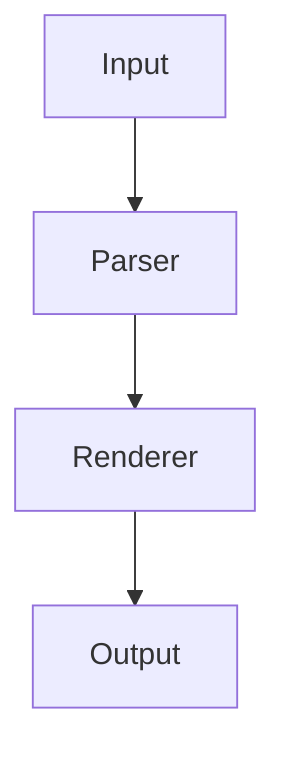

# Shine Test Document

This is a test document for **weave**, the terminal Markdown viewer.

## Features

Here is some *italic text* and some **bold text** and some `inline code`.

### Links and Images

Check out [Go](https://golang.org) for more info.


#### Detailed Notes

Some H4-level content.

##### Implementation Details

Some H5-level content.

###### Footnotes

Some H6-level content.

## Code Blocks

```go
package main

import "fmt"

func main() {
	fmt.Println("Hello from weave!")
}
```

```bash
$ go build ./cmd/weave
$ ./weave README.md
```

```tree
weave/
  cmd/
    weave/
      main.go
  internal/
    renderer/
      renderer.go
    theme/
      theme.go
  go.mod
  README.md
```

```diagram
+----------+     +----------+     +--------+
|  Input   |---->|  Parser  |---->| Output |
+----------+     +----------+     +--------+
```



## Lists

- First item
- Second item
  - Nested item
  - Another nested
- Third item

1. Step one
2. Step two
3. Step three

## Blockquotes

> This is a blockquote.
> It can span multiple lines.

> Outer quote
>> Nested quote

## Tables

| Feature | Status | Notes |
|---------|--------|-------|
| Headings | Done | H1-H6 |
| Code blocks | Done | With containers |
| Tables | Done | Box-drawing |
| Lists | Done | Nested support |

## Task Lists

- [x] Completed task
- [ ] Pending task
- [x] Another done item

---

That's all folks.
